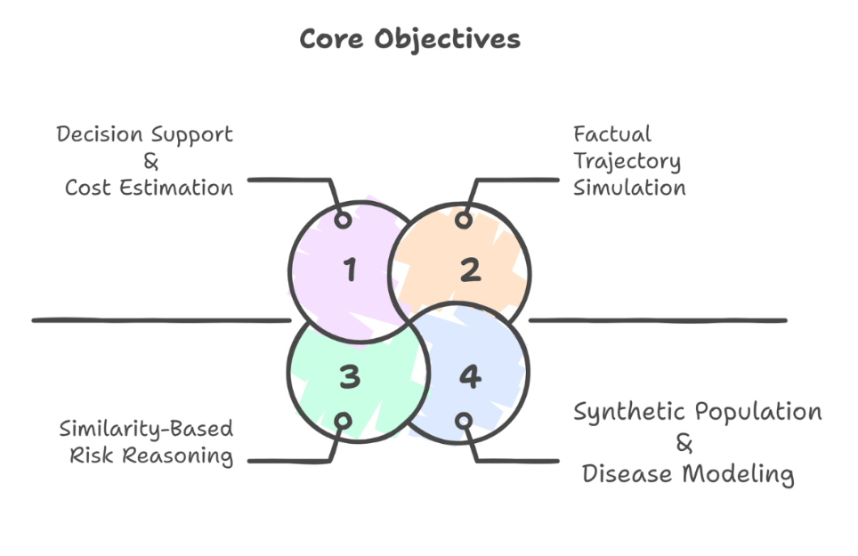
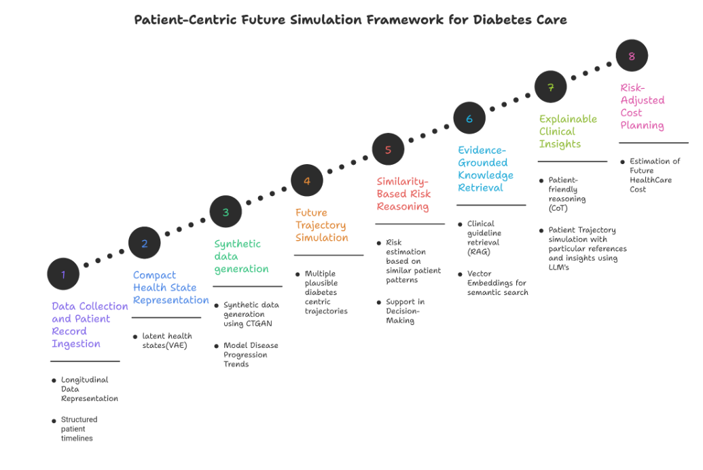

# Patient-Centric Future Simulation for Diabetes Care using Generative AI

A generative AI pipeline that transforms raw patient records into probabilistic health trajectories, evidence-grounded clinical insights, and healthcare cost planning.

---

# Problem Statement

Diabetes care should proactively predict how a patient’s condition will change under different treatments using a complete and unified medical history.

However, diabetes data remains fragmented across reports, so disease progression and risks are not systematically anticipated in India’s healthcare setting. This gap leads to preventable complications, delayed interventions, and significant long-term financial burden for patients.

Therefore, a patient-centered approach is needed to convert diabetes records into predictive, explainable insights that guide effective and affordable treatment decisions.

---

# Objectives



---

# Key Features

- **Longitudinal Patient Modeling:** Unifies scattered lab reports into time-aware patient timelines, enabling trend detection over isolated snapshots.

- **Compact Health Representations:** Reduces high-dimensional patient history into latent health states.

- **Synthetic Patient Generation:** Generates realistic synthetic populations to overcome data scarcity and privacy barriers in EHR-based training.

- **Probabilistic Forecasting:** Simulates a range of plausible future health trajectories per patient, replacing false certainty with realistic risk spread.

- **Similarity-Based Risk Reasoning:** Grounds risk assessment in real historical outcomes — surfacing what happened to patients with similar trajectories.

- **Evidence-Grounded Insights:** Anchors every LLM output to retrieved clinical guidelines, eliminating speculation in clinical responses.

- **Explainable Clinical Reasoning:** Delivers step-by-step reasoning a patient can understand.

- **Risk-Adjusted Cost Planning:** Converts predicted trajectories into concrete cost estimations for proactive insurance and treatment planning.

---

# Technology Stack

| Category | Key Technologies |
|---|---|
| Languages | Python |
| Data Processing | NumPy, Pandas, SciSpacy |
| Generative Modeling | GANs, VAEs, Conditional Tabular GANs (CTGAN) |
| Sequential Modeling | LSTM, Dynamic Time Warping (DTW) |
| Deep Learning Framework | PyTorch |
| ML Utilities | Scikit-Learn |
| Knowledge Retrieval | RAG, FAISS, Pinecone, OpenAI Embeddings |
| Explainability / Reasoning | LLMs, LangChain, Chain-of-Thought (CoT) |
| LLM API | OpenAI API |

---

# Patient-Centric Future Simulation Framework for Diabetes Care



---

# Detailed Architecture (8 Phases)

## Phase 1 — Data Collection and Patient Record Ingestion

Organize and clean raw patient lab reports into structured longitudinal timelines.

- Longitudinal Data Representation
- Medical Data Cleaning and Normalisation

**Output:** Structured patient timelines

---

## Phase 2 — Compact Health State Representation

Compress patient health history into dense latent vectors using Variational AutoEncoders.

- AutoEncoders (Encoder–Decoder)
- Variational AutoEncoders (VAE)

**Output:** Latent health states representing patient condition

---

## Phase 3 — Synthetic Data Generation

Generate privacy-preserving synthetic patient data and model diabetes disease progression trends.

- Generative Adversarial Networks (Generator and Discriminator)
- Conditional Tabular GANs (CTGAN)

**Output:** Synthetic data generation using CTGAN; modeled disease progression trends

---

## Phase 4 — Future Trajectory Simulation

Generate multiple plausible diabetes-centric future health trajectories per patient using probabilistic forecasting.

- Sequential Generation
- Probabilistic Sampling
- Monte Carlo Rollouts
- Temporal Generative Models

**Output:** Multiple plausible diabetes-centric trajectories per patient

---

## Phase 5 — Similarity-Based Risk Reasoning

Identify nearest-neighbour trajectories from historical data to estimate risk and support clinical decision-making.

- Cosine Similarity and Euclidean Distance
- Dynamic Time Warping (DTW)
- LSTM-based sequence comparison

**Output:** Risk estimation based on similar patient patterns; decision-making support

---

## Phase 6 — Evidence-Grounded Knowledge Retrieval

Retrieve clinically relevant guidelines and past records using RAG to ground LLM responses and prevent hallucinations.

- Retrieval-Augmented Generation (RAG)
- Vector Embeddings for semantic search

**Output:** Clinical guideline retrieval; semantically grounded context for LLMs

---

## Phase 7 — Explainable Clinical Insights

Generate transparent, doctor-friendly clinical insights with step-by-step reasoning over patient trajectories.

- Chain-of-Thought (CoT) Reasoning
- Medical Insight Generation
- Agent Reasoning via LangChain

**Output:** Patient-friendly CoT reasoning; trajectory simulation with references and insights using LLMs

---

## Phase 8 — Risk-Adjusted Cost Planning

Estimate future healthcare costs from predicted trajectories and deliver actionable insurance planning insights.

- Risk Band Mapping
- Cost Modeling

**Output:** Estimation of future healthcare cost; risk-adjusted financial planning recommendations

---

# Pima Indians Diabetes ML + RAG + LLM Pipeline (Clinicagen Implementation)

This section documents the implementation of the **Clinicagen Chatbot** which integrates Phase 6 and Phase 7 of the architecture into a conversational healthcare application.

## Clinicagen Architecture

```
PIMA PATIENT INPUT (8 features)
         │
         ▼
  INPUT VALIDATION
  (type, range, zero-as-missing)
         │
         ▼
  PREPROCESSING & PREDICTION
  (MedianImputer → StandardScaler → SVM Classifier)
         │
    ┌────┴────┐
    ▼         ▼
  CLASS     MODEL
  LABEL   CONFIDENCE
    └────┬────┘
         │
         ▼
  LOCAL SENSITIVITY ANALYSIS
  (deterministic ±1σ perturbation)
         │
         ▼
     RAG QUERY
  (context-aware query generation)
         │
         ▼
    FAISS SEARCH
  (BAAI/bge-base-en-v1.5 embeddings)
         │
         ▼
  RETRIEVED MEDICAL CHUNKS
  (CDC + NIDDK literature)
         │
         ▼
  GROQ LLM (openai/gpt-oss-120b)
  (Grounded context + structured JSON response)
         │
         ▼
  EXPLANATION CARDS & RICH HTML CHAT
```

### Installation

```bash
# Install dependencies from lock file
pip install -r requirements.lock
```

### Fresh Setup

Run these commands in order to prepare the local index and assets:

```bash
# 1. Train/serialize SVM prediction model artifacts
python scripts/rebuild_legacy_artifacts.py --force

# 2. Run artifact validation suite
python scripts/artifact_gate.py

# 3. Download source guidelines from NIDDK & CDC
python scripts/download_medical_sources.py

# 4. Generate local FAISS vector embeddings
python scripts/build_index.py

# 5. Start the FastAPI API server
uvicorn app:app --reload --host 127.0.0.1 --port 8000
```
